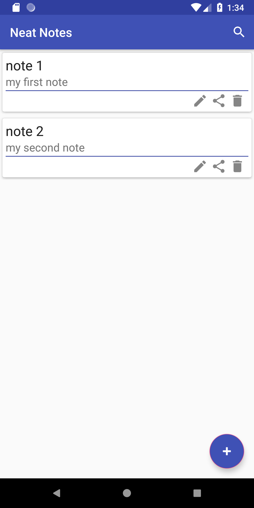
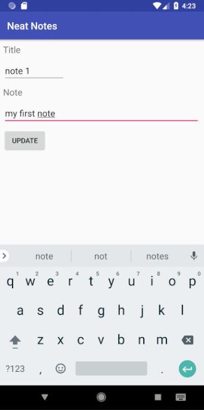

# NeatNotes

Notetaking app written in Kotlin and uses SQLite for databasing purposes.

Google Play: https://play.google.com/store/apps/details?id=com.akbar26.neatnotes
Installable Android APK: https://drive.google.com/file/d/1tT50L_Sd8NfYbNUHBzuq_4WwXZbHRpuF/view?usp=sharing

 

