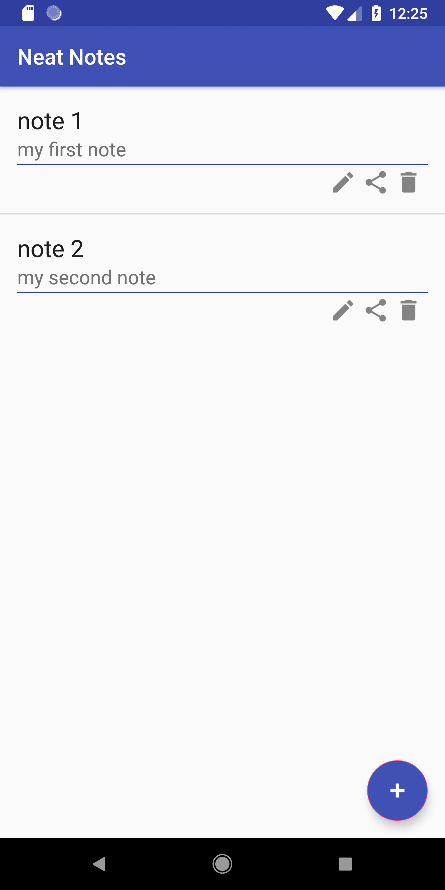

# NeatNotes

Notetaking app written in Kotlin and uses SQLite for databasing purposes.

Link to installable Android APK: https://drive.google.com/file/d/1tT50L_Sd8NfYbNUHBzuq_4WwXZbHRpuF/view?usp=sharing

 

